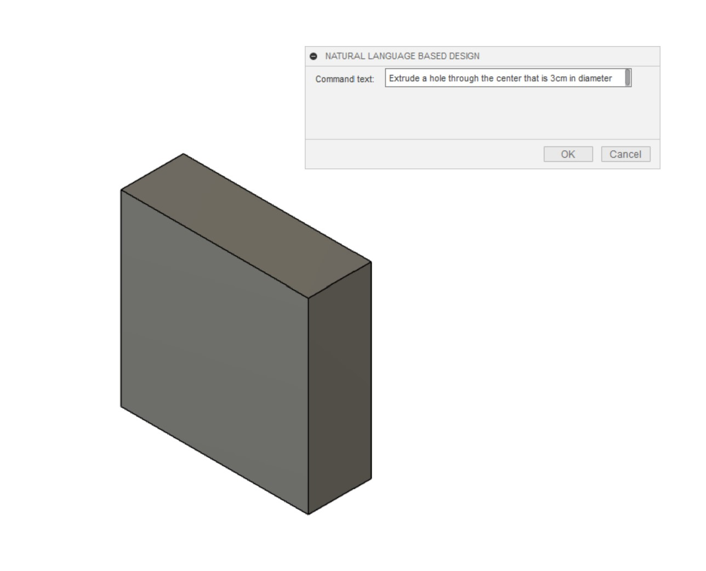
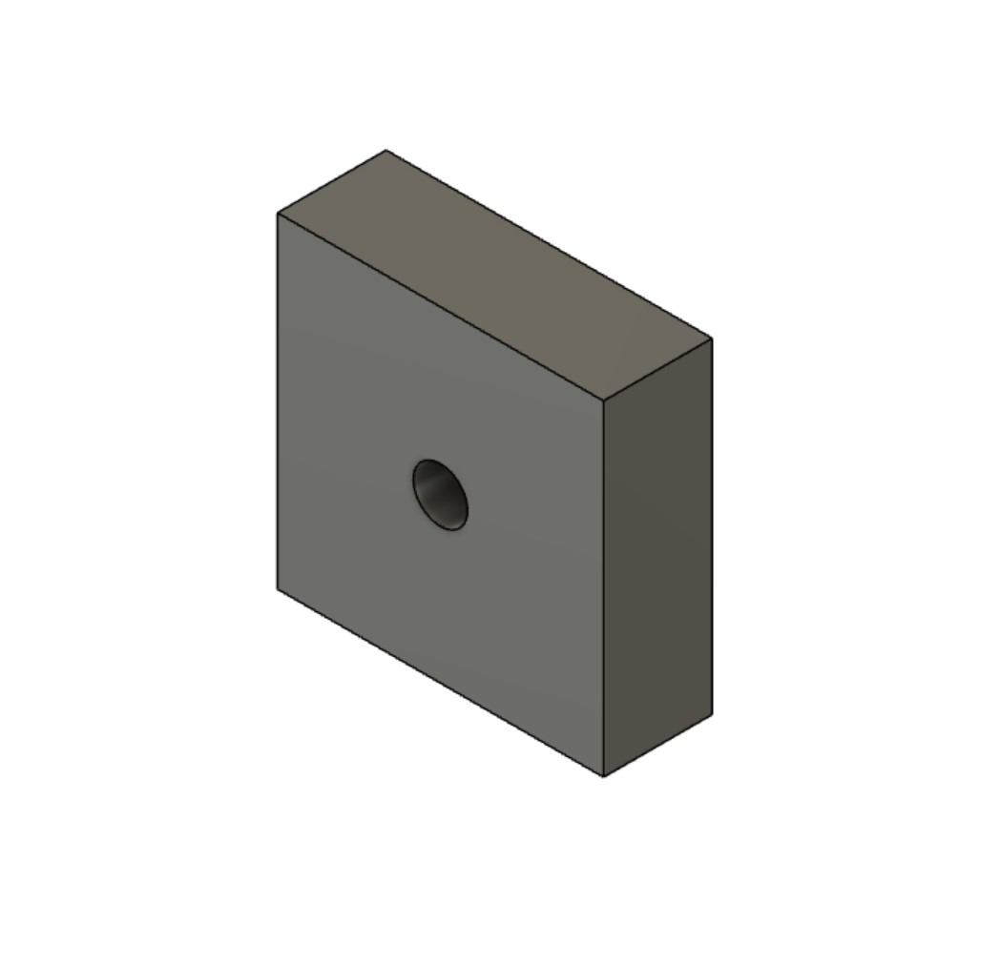

# NLP Fusion
NLP Fusion is an Autodesk Fusion 360 Add-in to automate tasks with natural language prompts. Powered by codex.

Here's an example:

Result:

## Installation
### Prereqs
1. Have Autodesk Fusion 360 installed. (You only need the free version)
2. Create an account with OpenAI

### Steps
1. Clone this repository
2. Create a file called OPENAI_API_KEY and store your API key in it
2. In Autodesk Fusion 360 go to design tab, utilities, then select scripts and add-ins. 
3. Select the plus icon to add an add-in. 
4. Navigate to this repository folder and select it. 
5. VOila! You are done. 
